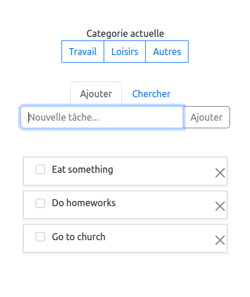

It is a todo app designed for efficient task management made using [bootstrap](https://github.com/twbs/bootstrap). It provides a simple and user-friendly interface to organize and track your tasks.

## Features

- Create tasks with a title.
- Categorize tasks under three main categories: Work, Leisure, and Other.
- Mark tasks as completed or uncompleted.
- Search for tasks based on their title.

## Getting Started

To run it on your local machine, follow these steps:

1. Clone this repository to your local machine.
2. Navigate to the project directory.
3. Paste the path to the `index.html` file in your web browser.

## Usage

### Task Creation

1. Click on the "Create Task" button.
2. Enter the task title.
3. Select the appropriate category for the task (Work, Leisure, or Other).
4. Click on the "Save" button to create the task.

### Task Completion

1. Click on the checkbox next to the task you want to mark as completed.
2. The task will be visually indicated as completed.

### Searching for Tasks

1. Enter your search query in the search bar.
2. The app will dynamically filter and display tasks that match the search query.

## Contributing

Contributions are welcome! If you have suggestions for new features, improvements, or bug fixes, please open a pull request.
